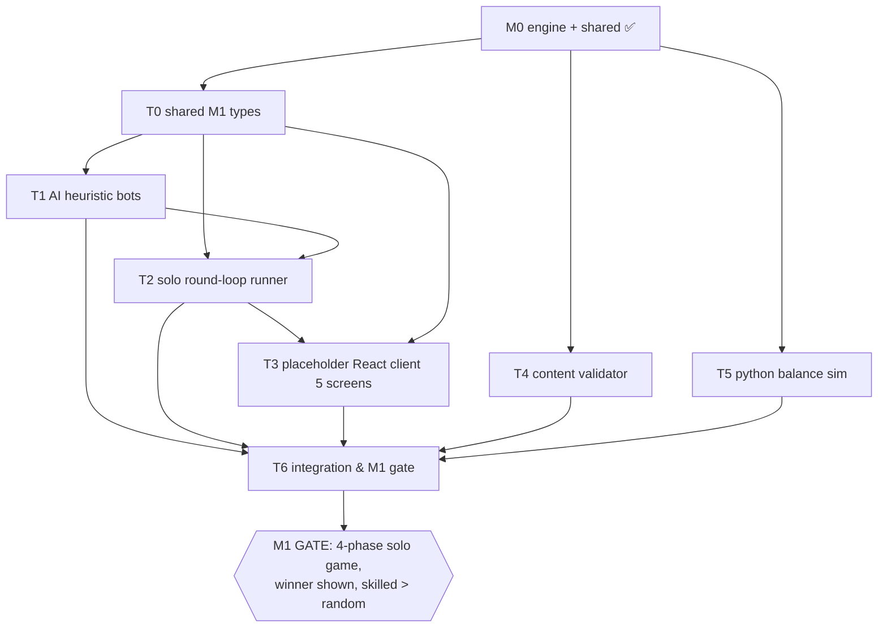

# EconWar — Milestone 1 Backlog (Single-Player Vertical Slice)

> Owner: **Producer (role 13)**. Status: 🟡 **IN PROGRESS** (2026-06-13).
> Parent: [`ROADMAP.md`](./ROADMAP.md) · Decisions: [`DECISION_LOG.md`](./DECISION_LOG.md) · Risks: [`RISK_REGISTER.md`](./RISK_REGISTER.md)
>
> **M1 GATE (the definition of done for the whole milestone):**
> finish a full **4-phase solo game and see a winner**, with all five round-loop steps running
> against the real `@econwar/engine`, AND a Python sim showing **skilled play beats random guessing**.

## Ground truth

- ✅ M0 complete: `@econwar/engine` + `@econwar/shared` green (18 Vitest + 6 pytest, golden TS↔Python parity).
- 🟡 `packages/ai` and `packages/solo` exist as **scaffolded stubs** (`src/index.ts`, `ai/src/types.ts`).
- ⚪ No `apps/client` yet — the placeholder React client is to be created in M1.
- Engine stays **pure**; everything in M1 consumes it, nothing in M1 changes economy logic.

## Roles (per `../politics/AI_Agent_Studio_Framework.md`, tech mapped to the committed web stack)

| Short | Role |
|---|---|
| GP | Gameplay Programmer |
| TDP | Tools & Data Pipeline Engineer |
| UX | UI/UX Designer |
| ECON | Economy & Progression Designer |
| QA | QA & Balance Analyst |
| TD | Technical Director (advisory: package boundaries) |

---

## Tasks

### T1 — AI heuristic bots (`@econwar/ai`)
- **Owner:** GP (ECON advises on strategy weights)
- **Depends on:** M0 engine (done); T0-types below
- **Deliverable:** `decideAllocation(view, dept, pc)`, `decideVote(view, candidates)`,
  `decideAbility(view, dept, pc)` — pure functions consuming the `ClientView` from `project()`.
- **Acceptance:**
  - At least 3 distinct strategies (e.g. growth-chaser, defensive, indicator-reader) plus a `random` baseline bot.
  - Bots only read what a real client can read (no peeking at hidden `phase.type` / `controllerTilt`).
  - Outputs are valid intents (allocations sum to capital; ability only when PC affords it).
  - Unit tests cover each strategy's decision on a fixed `ClientView`.

### T0 — Shared M1 intent/view types (in `@econwar/shared` or `@econwar/ai`)
- **Owner:** GP + TD
- **Depends on:** M0
- **Deliverable:** the bot/runner-facing type surface (`Candidate`, `BotStrategy`, intent shapes) reusing existing `shared/types.ts`.
- **Acceptance:** no duplication of engine types; named ESM exports; `tsc --build` clean. *(Small enabling task; do first.)*

### T2 — Solo round-loop orchestrator (`@econwar/solo`)
- **Owner:** GP
- **Depends on:** T0, T1 (consumes bots), M0 engine
- **Deliverable:** a runner that drives the **five steps** for 4 phases:
  reveal → vote (mocked tally via engine `voteTally`) → controller tilt → allocate + ability → `settlePhase`.
- **Acceptance:**
  - `runSoloGame(seed, humanIntents | scriptedIntents)` plays 4 phases and returns the final leaderboard + winner.
  - Uses `stateMachine` for phase transitions and `pcLedger` for PC accrual/spend.
  - A headless test runs a full game from a seed and asserts a single winner emerges.
  - All hidden fields stay hidden until `settled === true` at each phase (uses `project()`).

### T3 — Placeholder React client (5 screens)
- **Owner:** UX (IA) + GP (wiring)
- **Depends on:** T2 (drives the loop); T0 (types)
- **Deliverable:** `apps/client` placeholder UI for the 5 screens from `../core/03_Art_Direction_Stardew.md` §5
  (no pixel art yet — boxes + labels), wired to `@econwar/solo`:
  1. Lobby / Department Select
  2. Region Map (allocate across 4 regions)
  3. Portfolio Panel (holdings + net worth)
  4. Voting Hall (Controller election)
  5. Phase Settlement (gains/losses reveal) → Leaderboard
- **Acceptance:**
  - A human can click through one complete 4-phase game and see the winner.
  - Allocation input sums to available capital; ability button costs PC; vote casts one ballot.
  - Money formatted to `฿` only at the display edge (engine stays integer satang).
  - Touch-friendly layout (sliders/taps, single-column reflow) per `../core/04` mobile prep.

### T4 — Content validator (CLI)
- **Owner:** TDP
- **Depends on:** M0 (Zod schemas in `@econwar/shared`)
- **Deliverable:** a script that validates all `shared/content/*.json` (regions, departments,
  abilities, eventDeck, voting constants) against the Zod schemas and fails non-zero on error.
- **Acceptance:**
  - Runnable as an npm script; CI-friendly exit codes.
  - Catches schema violations, missing references, and out-of-range basis-point values.
  - Green against the current committed content.

### T5 — Python balance sim (`lab/`)
- **Owner:** ECON + QA
- **Depends on:** M0 Python engine port (done)
- **Deliverable:** a Monte-Carlo runner that plays many solo games with bot strategies and a random baseline.
- **Acceptance (the skilled-beats-random check):**
  - Over N games, a skilled strategy's mean final net worth **statistically beats** the random bot's.
  - Output is a short report (win-rate / mean net worth per strategy).
  - Reuses the existing `lab/econwar_engine` so results stay consistent with TS golden vectors.

### T6 — Integration & test gate
- **Owner:** QA (with GP)
- **Depends on:** T1, T2, T3, T4, T5
- **Deliverable:** end-to-end verification of the M1 gate.
- **Acceptance:**
  - Headless full-game test green (T2) **and** a human can complete a game in the UI (T3).
  - Content validator green (T4); Python skilled-beats-random green (T5).
  - `npm run typecheck` + `npm test` + `npm run lab:test` all green.
  - No pre-SETTLE leak anywhere in the solo path.

---

## Dependency graph

## Critical path
`M0 → T0 → T1 → T2 → T3 → T6 → GATE`. T4 and T5 run in parallel off M0 and only converge at T6, so
they are not on the critical path unless they fail — but the **skilled-beats-random** result (T5) is
a hard gate condition, so it must be green before M1 closes.
