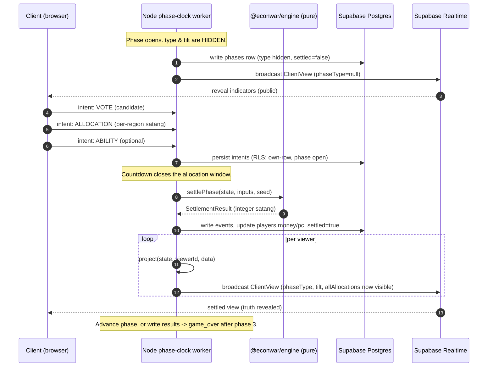

# EconWar — Multiplayer Architecture (runtime topology)

> Owner: **Technical Director**. The server-authoritative runtime for multiplayer
> (M3 core 8–16, M4 scale ~260). Source of truth: [`../CLAUDE.md`](../CLAUDE.md)
> ("Resolved decisions"), [`../core/02_Technical_Architecture.md`](../core/02_Technical_Architecture.md) §3/§5.
>
> Related: [`DECISION_LOG.md`](./DECISION_LOG.md) (ADR-0003/0004/0006) ·
> [`RISK_REGISTER.md`](./RISK_REGISTER.md) (R3/R4/R6) ·
> [`LOAD_TEST_PLAN.md`](./LOAD_TEST_PLAN.md) ·
> [`../apps/server/db/README.md`](../apps/server/db/README.md) ·
> [`../apps/server/db/rls.sql`](../apps/server/db/rls.sql)

---

## 1. Topology — who owns what

```
┌──────────────────────────── CLIENTS (browsers, up to ~260) ────────────────────────────┐
│  React UI + Phaser scene + Zustand store                                                │
│  Sends INTENTS only:  allocation · vote · ability                                       │
│  Renders the per-client ClientView it receives over Realtime                            │
└───────────────▲───────────────────────────────────────────────────┬────────────────────┘
                │  Realtime broadcast (per-client ClientView diffs)   │  intents
                │                                                     ▼
        ┌───────┴───────────────────┐                    ┌──────────────────────────────┐
        │   SUPABASE                 │                    │  NODE PHASE-CLOCK WORKER       │
        │   • Postgres (state)       │◄── service_role ───┤  (always-on, ADR-0006)         │
        │   • Auth (anon sessions)   │   reads/writes     │  • FSM: lobby→reveal→vote→     │
        │   • Realtime (broadcast)   │   the TRUTH        │    controller→allocate→settle  │
        └────────────────────────────┘                    │  • countdown timer per step    │
                ▲  anon (RLS-gated reads)                  │  • calls settlePhase() (engine)│
                └──────────────────────────────────────── │  • project() → per-client view │
                  clients may read RLS-safe game data      │  • writes results, flips settled│
                  (backstop; normal path is the broadcast) └──────────────────────────────┘
                                                                    │ imports
                                                                    ▼
                                                       @econwar/engine (PURE settlePhase)
```

- **Node phase-clock worker (the authority).** A small always-on process. It owns the
  finite-state machine, the per-step countdown timer, the collection of intents, the
  call to the pure `settlePhase()` at window close, and all writes of *truth* to
  Postgres (via the `service_role` key, which bypasses RLS). Edge Functions/Deno are a
  viable alternative for one-shot settlement, but the **long-lived timer lives in Node**
  (ADR-0006).
- **Supabase.** Postgres (the durable state — see [`schema.sql`](../apps/server/db/schema.sql)),
  Auth (anonymous/room-token sessions, ADR-0003), and Realtime (broadcast channel per game).
- **Clients.** Send intents; never compute truth. Render the `ClientView` they receive.
- **`@econwar/engine`.** Pure, deterministic, shared verbatim with solo play. The worker
  is just another caller of `settlePhase(state, inputs, seed)`.

## 2. Why server-authoritative (Golden rule #4)

The game is built on **hidden information**: the true `phase.type`, the `controllerTilt`,
and rivals' allocations are secret until settlement. If a client computed outcomes (or
received raw state), a modified client could read the hidden truth and win unfairly. So:

- Clients submit **intents** (allocation / vote / ability). They never decide outcomes.
- The worker alone runs `settlePhase()` and is the single source of truth.
- It never broadcasts raw state — only per-client `ClientView` via `project()`.

This also makes 260 players tractable: the game is **phase-based, not twitch** — heavy
traffic happens only at phase boundaries, and generous time windows absorb latency
(R3). See [`LOAD_TEST_PLAN.md`](./LOAD_TEST_PLAN.md).

## 3. The intent → settle → broadcast flow

One phase moves through these FSM steps (mirrors `GamePhaseStep` in
`packages/shared/src/types.ts`):

`lobby → indicator_reveal → vote → controller_action → allocation → settlement → (next phase | game_over)`

1. **indicator_reveal** — worker reveals public `indicators` (NOT the hidden `type`),
   broadcasts a `ClientView` with `phaseType = null`.
2. **vote** — clients submit a vote intent (department-slate ballot, ADR-0005). Worker
   tallies with the engine's `voteTally` (weight = `1 + min(floor(pc/PC_PER_BONUS_VOTE), MAX_BONUS_VOTES)`).
3. **controller_action** — elected Market Controller submits a tilt intent; worker clamps
   it to `±MAX_TILT_BP` and stores `controller_tilt` (still hidden).
4. **allocation** — every client submits its allocation intent before the countdown ends.
5. **settlement** — at window close the worker calls `settlePhase()`, draws the event with
   the seeded RNG, writes `events` + new `players.money`/`pc`, sets `phases.settled = true`.
6. **broadcast** — worker `project()`s a `ClientView` **per viewer** (now with `phaseType`,
   `controllerTilt`, and `allAllocations` populated) and broadcasts the diffs. Advance
   `current_phase`, or write `results` and go `game_over` after phase index 3.

### Sequence diagram (one phase)



## 4. How `project()` + RLS prevent leaks (Golden rule #5)

Two independent layers guarantee no pre-SETTLE leak (risk R6):

1. **`project()`** ([`packages/shared/src/project.ts`](../packages/shared/src/project.ts))
   — the only path raw state takes to a client. It returns `phaseType`, `controllerTilt`,
   and `allAllocations` as `null` until `settled === true`; a viewer always sees their own
   allocation, rivals' only after settle. The worker broadcasts these views, never raw rows.
2. **RLS** ([`rls.sql`](../apps/server/db/rls.sql)) — the backstop if a client queries
   Postgres directly with the anon key: no client SELECT on raw `phases` (read `phases_client`,
   which nulls `type`/`controller_tilt` until settled); `allocations`/`votes`/`abilities_used`
   readable only as own-row or once the phase is settled.

A build/integration test must fail if a pre-SETTLE broadcast payload contains the phase
type (extend the engine's existing leak test to the network path in M3 — R6 mitigation).

## 5. Reconnect & idempotency

- **Reconnect (ADR-0003):** sessions are ephemeral join-code + nickname; the client keeps
  its `session_token`. On reconnect it re-subscribes to the game's Realtime channel and the
  worker re-sends the current `ClientView` (full snapshot, then diffs). No game state lives
  on the client, so a refresh loses nothing. M4 adds reconnect backoff.
- **Idempotent intents:** allocation/vote/ability are **upserts** keyed by uniqueness
  constraints (`allocations(player_id,phase_id,region)`, `votes(phase_id,voter_id)`,
  `abilities_used(player_id,phase_id,ability)`). Re-submitting the same intent (e.g. after a
  flaky connection) overwrites rather than duplicates. Intents are only accepted while the
  phase is open (RLS `phase_is_open`); late re-sends after settlement are rejected.
- **Settlement is single-shot:** the worker settles each phase exactly once at window close
  and flips `settled`; the flag is the guard against double-settlement on worker restart
  (on restart, resume from the first unsettled phase).

## 6. Realtime payload budget (256 KB cap)

Supabase Realtime messages cap at **256 KB**. With ~260 players a naive full-state
broadcast would blow the cap and waste bandwidth. Therefore:

- Broadcast **per-client `ClientView` diffs**, not the whole game state.
- The roster sent to a client is the public projection (nickname, dept, money, pc) — small.
- Rivals' allocations are omitted entirely until settlement, then sent once.
- Keep the settled-phase reveal compact (per-region values, not full event logs).

Budget sanity: ~260 players × a few public fields each is well under 256 KB; the only large
moment is the post-settle reveal, which is sent once per phase. Sizing & spikes are
load-tested in [`LOAD_TEST_PLAN.md`](./LOAD_TEST_PLAN.md).
